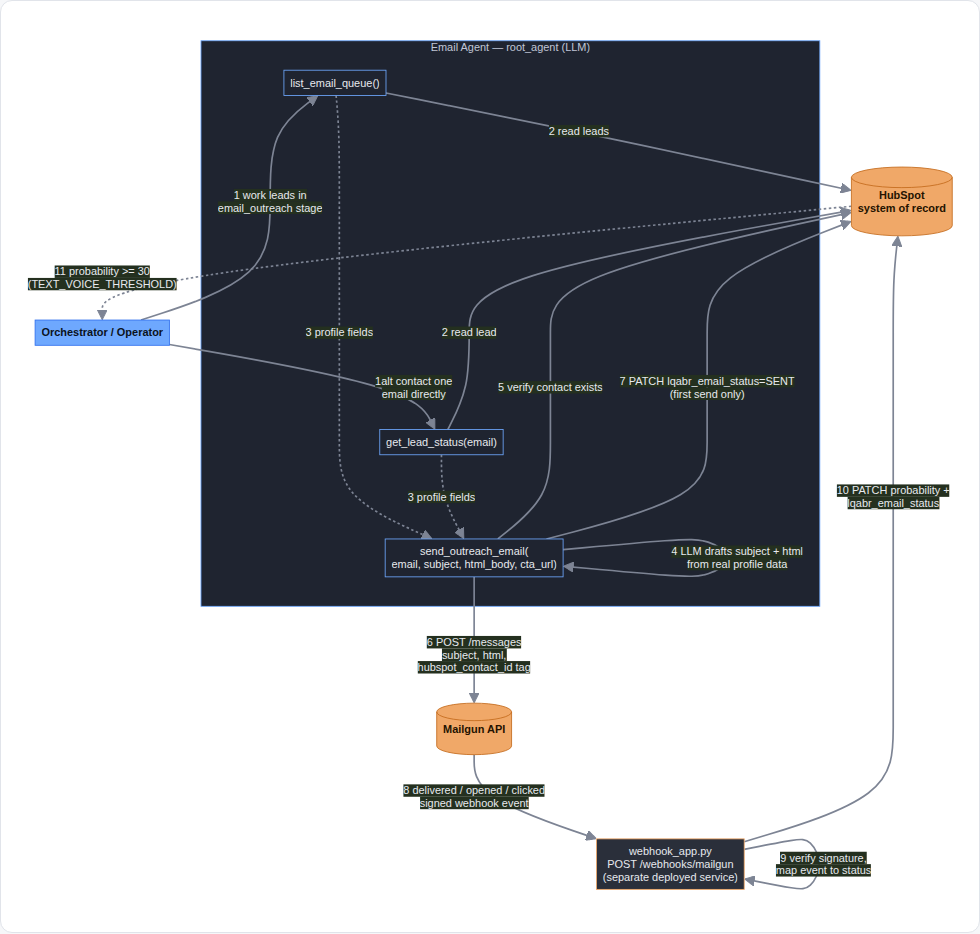
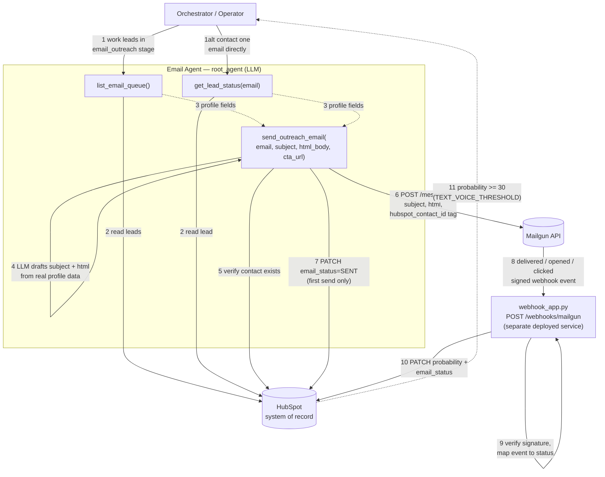

# Email Agent — Architecture & Data Flow

**Location:** `agents/email/` · **Epic:** E4 (see `docs/EPICS.md`) · **Last updated:** 2026-07-28

## 1. Purpose

The Email Agent is the first outreach stage in the LQABR pipeline. It owns exactly two responsibilities:

1. **Draft and send** a personalized first-touch email to a lead that already has a 9-pointer profile in HubSpot.
2. **Listen for engagement** (delivered / opened / clicked) and translate it into HubSpot state — `email_status` (shown in the UI under the label "email_status") and `probability` — so the orchestrator knows when to hand the lead to the next stage.

It does not decide *who* to contact next in the broader pipeline (that's the orchestrator's job), and it does not itself decide when a lead is "hot enough" to promote — it only writes the signal; `lqabr_core/probability.py` owns the threshold logic.

## 2. Components

| Component | File | Role |
|---|---|---|
| `root_agent` (ADK Agent) | `agents/email/src/email_agent.py` | The LLM-driven agent. Decides *what* to send and *when*, using its tools. |
| Agent tools | same file: `list_email_queue`, `get_lead_status`, `send_outreach_email` | Typed, deterministic functions the LLM calls — HubSpot reads, one HubSpot-gated Mailgun send. |
| ADK discovery shim | `agents/email/src/agent.py` | Re-exports `root_agent` so `adk web/run agents/email/src` finds it. |
| Model wiring | `packages/lqabr_core/lqabr_core/model.py` (`build_model`) | Maps a plain model-name string to either ADK's native Gemini client or a LiteLlm wrapper (e.g. for `anthropic/claude-sonnet-5`) — the agent file never hardcodes a provider. |
| Mailgun webhook | `agents/email/src/webhook_app.py` | A separate FastAPI service (not the agent). Receives Mailgun's signed event callbacks and writes engagement back to HubSpot. Deployed independently (Cloud Run, per `infra/gcp/05_deploy_agents.sh`). |
| CRM adapter | `packages/lqabr_core/lqabr_core/crm/hubspot.py` (`HubSpotClient`) | The only code that talks to HubSpot's REST API. Owns retries, property-name mapping, and the probability/stage writeback logic (`record_event`). |
| Mailgun client | `packages/lqabr_core/lqabr_core/mailgun.py` (`MailgunClient`) | The only code that talks to Mailgun's REST API. Owns retries and webhook signature verification. |
| Probability engine | `packages/lqabr_core/lqabr_core/probability.py` | Single source of truth for point values (`delivered`=2, `opened`=5, `clicked`=10) and promotion thresholds (`TEXT_VOICE_THRESHOLD`=30). |
| Secrets | `packages/lqabr_core/lqabr_core/secrets.py` | Resolves `LQABR_MAILGUN_API_KEY` / `LQABR_HUBSPOT_ACCESS_TOKEN` from env var or GCP Secret Manager. |

## 3. Mailgun Webhook Service — Endpoint Reference

`agents/email/src/webhook_app.py` is a separate FastAPI service — not the ADK agent process, not started by `adk run`/`adk web`. It's what actually closes the loop from a sent email back into HubSpot state.

**Endpoints**

| Method & path | Purpose |
|---|---|
| `GET /healthz` | Liveness check — returns `{"status": "ok"}`. |
| `POST /webhooks/mailgun` | Receives one Mailgun event per call and, if it's a scored event, writes the result back to HubSpot. |

**Event → score mapping** (`EVENT_MAP`, increments from `lqabr_core/probability.py`)

| Mailgun event | `EventType` | Probability increment | Notes |
|---|---|---|---|
| `delivered` | `EMAIL_DELIVERED` | +2 | |
| `opened` | `EMAIL_OPENED` | +5 | also reflects as the lead's latest-open time via `occurred_at` |
| `clicked` | `EMAIL_CLICKED` | +10 | internal link clicks; `detail` carries the clicked URL |
| anything else (`accepted`, `failed`, …) | — | 0 | acknowledged with `{"status": "ignored", "event": ...}` — not scored, nothing written to HubSpot |

**Request handling, in order**

1. Parse the JSON body Mailgun POSTs.
2. Verify `payload["signature"]` (`timestamp` / `token` / `signature`) via HMAC-SHA256 against the Mailgun webhook signing key (`verify_webhook_signature`) — mismatched/forged signatures get `401` before anything else runs.
3. Map `event-data.event` through `EVENT_MAP`. An event type we don't score returns `200 {"status": "ignored", "event": ...}` immediately.
4. Pull `hubspot_contact_id` out of `event-data.user-variables` — the same value `send_outreach_email` stamped onto the message at send time (see §5.1, step 7). Missing → `422`, and it's logged as an error rather than dropped quietly, since a missing ID here means the *send* path is misconfigured, not the webhook.
5. For a `clicked` event, also capture the clicked URL as `detail`.
6. Build an `EngagementEvent` and call `HubSpotClient.record_event()` — this single call applies the probability increment, writes `probability` + `email_status` back to HubSpot in one PATCH, and determines whether the lead has crossed `TEXT_VOICE_THRESHOLD`.
7. A `CRMError` from that call becomes HTTP `500`, deliberately — Mailgun retries on 5xx responses, so a transient HubSpot outage doesn't lose the event.
8. On success: `200 {"status": "recorded", "event": ..., "contact_id": ..., "probability": ..., "stage": ...}`.

**Deployment**

- Local dev: `uvicorn webhook_app:app --port 8081` (run from `agents/email/src`).
- Production: Cloud Run, provisioned by `infra/gcp/05_deploy_agents.sh` as service `lqabr-email-webhook`. Mailgun's dashboard webhook URL must point at this service's public URL + `/webhooks/mailgun` for events to ever arrive — **not currently deployed** (see §8, Known Gaps).

## 4. Architecture / Data Flow Diagram

Numbered steps correspond exactly to §5 below (1–7 outbound, 8–11 inbound). An interactive, self-contained version (same diagram, no external dependencies, opens in any browser) is included alongside this doc at `docs/email_agent_data_flow.html`.

Mermaid source (for editing — paste into any Mermaid-aware viewer to render)

## 5. Data Flow — Step by Step

### 5.1 Outbound: drafting and sending

1. The orchestrator (or a human operator) invokes the Email Agent, telling it to work leads in the `email_outreach` stage — or naming one specific email address directly.
2. The agent calls `list_email_queue()` (no target named) or `get_lead_status(email)` (target named) to pull that lead's real profile fields from HubSpot: `full_name`, `company`, `job_title`, `industry`, current `email_status`, current `probability`.
3. **The agent drafts its own subject line and HTML body**, grounded only in the profile fields it just read — it does not fabricate facts about the lead, their company, or any prior contact. If a field is missing, it writes around the gap rather than inventing a value.
4. The agent calls `send_outreach_email(contact_email, subject, html_body, cta_url)`.
5. Inside the tool: `HubSpotClient.find_lead_by_email()` re-verifies the contact exists in HubSpot (independent of step 2 — this is the actual gate; a lead not in `list_email_queue`'s limited page can still pass here).
6. `_safe_format()` substitutes any `{first_name}` / `{company}` / `{job_title}` / `{industry}` / `{cta_url}` / `{sender_name}` placeholders the draft happens to contain — plain substring replacement, so stray braces in the drafted text can't crash the send (unlike `str.format()`). If the agent supplied no draft at all, `DEFAULT_SUBJECT` / `DEFAULT_HTML` are used instead, so a send never fails for lack of content.
7. `MailgunClient.send_email()` POSTs to Mailgun with `o:tracking-opens`/`o:tracking-clicks` enabled and the lead's `hubspot_contact_id` attached as a Mailgun user-variable — this is the correlation key the webhook uses later.
8. If this is the lead's first send (`stage` was `PROFILED`/`INGESTED`), `HubSpotClient.set_stage()` writes `email_status = SENT`.
9. The tool returns `{"status": "sent", ...}` or a verbatim `{"error": ...}` — Mailgun/CRM failures are never swallowed.

### 5.2 Inbound: engagement → probability

See §3 above for the full endpoint-level reference; summarized in flow terms:

1. Mailgun fires a signed webhook event (`delivered`, `opened`, or `clicked`) to `webhook_app.py`'s `POST /webhooks/mailgun` — this only happens if the webhook service is actually deployed and its URL registered in Mailgun's dashboard; it is **not** something the agent process itself runs.
2. The webhook verifies the HMAC signature (`verify_webhook_signature`), rejecting anything unsigned/forged with `401`.
3. It reads `hubspot_contact_id` back out of the event's user-variables (the same value stamped in step 5.1.7) — a scored event missing this ID is a loud `422`, never a silent drop.
4. `HubSpotClient.record_event()` computes the new probability via `apply_event()` (delivered +2, opened +5, clicked +10, capped 0–100) and writes both `probability` and `email_status` back to HubSpot in one PATCH.
5. If the new probability crosses `TEXT_VOICE_THRESHOLD` (30), the lead's in-memory `stage` flips to `TEXT_VOICE_OUTREACH` — there is currently no HubSpot property that persists cross-agent pipeline stage directly, so the orchestrator picks this up by reading `probability` against the same threshold, not a stage field.
6. A HubSpot write failure here returns `500`, deliberately — so Mailgun's own retry mechanism resends the event rather than the engagement silently vanishing.

## 6. Configuration

| Env var | Purpose |
|---|---|
| `LQABR_EMAIL_MODEL` | Model string passed to `build_model()`, e.g. `anthropic/claude-sonnet-5` or a bare `gemini-*` name. |
| `LQABR_MAILGUN_API_KEY` / Secret Manager `lqabr-mailgun-api-key` | Mailgun auth. |
| `LQABR_MAILGUN_WEBHOOK_SIGNING_KEY` / Secret Manager `lqabr-mailgun-webhook-signing-key` | Verifies inbound Mailgun webhook signatures. |
| `MAILGUN_DOMAIN`, `MAILGUN_FROM` | Sending domain / from-address (plain env vars, not secrets). |
| `LQABR_HUBSPOT_ACCESS_TOKEN` / Secret Manager `lqabr-hubspot-access-token` | HubSpot private-app auth. |
| `LQABR_CTA_URL`, `LQABR_SENDER_NAME` | Defaults used when the draft doesn't specify a CTA link or sender name. |

## 7. Guardrails (enforced in the agent instruction + tool code)

- Never contacts an email address that isn't a real HubSpot contact — verified independently inside `send_outreach_email`, not just trusted from the LLM's own read.
- Never fabricates a lead's profile facts, prior contact, or engagement status — only reports what HubSpot actually returned.
- A failed Mailgun or HubSpot call is always surfaced verbatim, never silently ignored or retried-into-silence beyond the client's own bounded retry/backoff.
- Engagement (delivered/opened/clicked) is only ever recorded by the webhook processing a real Mailgun event — the agent cannot claim engagement happened on its own say-so.
- Drafted copy is grounded strictly in the lead's actual profile fields; missing fields are written around, never invented.

## 8. Known Gaps / Follow-ups

- The webhook (`webhook_app.py`) is not currently deployed anywhere — Mailgun has nowhere to push events to until it's stood up on Cloud Run (or similar) with a public HTTPS URL registered in Mailgun's dashboard. Until then, engagement can only be synced manually (see `agents/email/manual_mailgun_send.py`'s `status`/`watch` commands, built as a stand-in for local testing).
- There is no HubSpot property that persists cross-agent pipeline `stage` directly for the email channel — `email_status` (delivery lifecycle) and `probability` (score) are the only two fields; stage is inferred from probability by every consumer, not stored as its own value. Flagged in `hubspot.py` as a follow-up once the Text/Voice handoff needs a real field to read.
